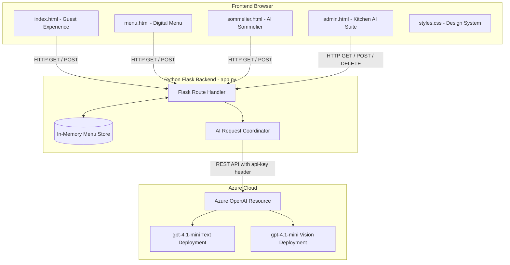

# Savory AI | Next-Gen Intelligent Dining & Revenue Engine

---

## 1. Project Overview

Savory AI is an intelligent restaurant menu platform that bridges the gap between guest dining satisfaction and restaurant business profitability. Powered by Azure OpenAI, it delivers personalized taste profiling, instant sommelier pairings, and dietary allergen evaluations for diners, while equipping restaurant clients with OCR physical menu scanning, automated social marketing generation, and dynamic profit-margin optimization.

---

## 2. Features

### 🍽️ For Diners & Customers
* **🎯 AI Personal Taste Profiler & Meal Builder**: Curates custom multi-course menus based on budget ($), dining vibe (*Romantic Date Night, High-Protein Fitness, Quick Gourmet Lunch*), and dietary restrictions.
* **💡 AI English Culinary Dish Explainer**: Translates complex or foreign culinary terms (*Burrata, Wagyu, Beurre Blanc, Gnocchi*) into plain, easy-to-understand English.
* **🍷 Master Sommelier & Beverage Pairing Engine**: Generates 3 curated beverage pairings (*Fine Wine, Craft Beer, Artisanal Mocktail*) for any dish.
* **📊 AI Sensory Flavor & Texture Breakdown**: Evaluates Umami, Richness, Spice, Sweetness, Acidity, and Texture Crunch scores out of 10.
* **🛡️ AI Allergen & Safety Evaluator**: Provides instant ingredient safety analyses for guest allergies or dietary restrictions.
* **🛒 Interactive Tasting Order Drawer**: Real-time total bill calculation, calorie tracking, and order submission.

### 📈 For Restaurant Clients & Managers
* **📸 AI Vision Physical Menu Scanner (OCR)**: Uploads photos of physical restaurant menus to parse dishes, prices, and dietary tags automatically into the database via Azure OpenAI Vision.
* **📣 AI Social Media & Viral Marketing Generator**: Generates Instagram captions with hashtags, TikTok/Reel video script concepts, and Google Business posts for any menu dish in 1 click.
* **📈 AI Profit Margin & Dynamic Pricing Audit**: Performs real-time profitability audits on active menu pricing to maximize restaurant net margins without alienating diners.
* **✍️ AI Michelin-Star Copywriter**: Drafts sensory dish descriptions across multiple tones (*Fine Dining, Casual Friendly, Short & Punchy, Artisanal Story*).
* **📋 Live Menu Management Studio**: Full CRUD operations for updating, adding, or deleting dishes in real-time.

---

## 3. Tech Stack

| Component | Technology | Role / Purpose |
| :--- | :--- | :--- |
| **Backend Framework** | **Python (Flask)** | RESTful API server, template routing, JSON serialization, and request handling. |
| **AI Orchestration** | **Azure OpenAI API** | Large Language Model (`gpt-4.1-mini`) for chat, copywriting, reasoning, and vision OCR. |
| **SDK & Utilities** | **OpenAI Python SDK**, `python-dotenv` | Standardized API client calls with custom headers (`api-key`) and `.env` loader. |
| **Frontend Core** | **HTML5 & Vanilla JavaScript** | Lightweight multi-page document structure, async `fetch` API calls, and DOM manipulation. |
| **Design & Styling** | **Vanilla CSS3** | High-end luxury dark-gourmet aesthetic (`#0b0f0e`), gold accents (`#e2b857`), glassmorphic panels, and custom dropdown styling. |
| **Typography** | **Google Fonts** | *Plus Jakarta Sans* (UI text), *Playfair Display* (gourmet headings), *DM Mono* (price & calorie badges). |

---

## 4. Architecture



---

## 5. Project Structure

```
c:/Users/ASUS/Downloads/files (1)/
├── app.py                # Main Python Flask backend & Azure OpenAI API endpoints
├── index.html            # Guest Dining Experience, Taste Profiler & AI Concierge
├── menu.html             # Full Digital Intelligent Menu with search & category filters
├── sommelier.html        # AI Sommelier & Beverage Pairing Lounge
├── admin.html            # Kitchen & Restaurant Manager AI Suite
├── styles.css            # Luxury dark-gourmet CSS design system & custom dropdowns
├── README.md             # Project documentation & sitemap
├── requirements.txt      # Python dependencies (flask, openai, python-dotenv, requests)
├── .env                  # Environment variables (Azure OpenAI Endpoint & API Key)
└── scratch/              # Automated route & AI testing scripts
    ├── test_ai.py
    ├── test_routes.py
    ├── test_explain.py
    └── test_power_ai.py
```

---

## 6. Installation & Setup

### Prerequisites
* **Python 3.9+** installed on your system.
* Active **Azure OpenAI Resource** endpoint and API key.

### Step 1: Install Dependencies
```bash
pip install -r requirements.txt
```

### Step 2: Configure Environment Variables
Create or verify the `.env` file in the root directory:
```env
AZURE_OPENAI_ENDPOINT=https://<your-resource>.openai.azure.com/openai/v1
AZURE_OPENAI_API_KEY=<your-azure-api-key>

TEXT_MODEL_DEPLOYMENT=gpt-4.1-mini
VISION_MODEL_DEPLOYMENT=gpt-4.1-mini
IMAGE_MODEL_DEPLOYMENT=FLUX-1.1-pro
```

### Step 3: Run the Application
```bash
python app.py
```
The server will start locally at **`http://127.0.0.1:5000`**.

---

## 7. Usage

1. **Explore the Guest Experience (`http://127.0.0.1:5000/`)**:
   - Click **"Build My AI Curated Meal Package"** to test the AI Personal Taste Profiler under a specified budget.
   - Enter culinary terms (e.g. *Burrata*, *Beurre Blanc*) in the **AI Dish Explainer** to get plain English explanations.
   - Click **💬 Ask AI Concierge** to ask dietary questions or request table recommendations.
2. **Browse the Digital Menu (`http://127.0.0.1:5000/menu`)**:
   - Filter dishes by category (*Starters, Mains, Desserts, Beverages*) or dietary tags (*Vegetarian, Gluten-Free*).
   - Add items to your **Tasting Order Drawer**.
3. **Consult the AI Sommelier (`http://127.0.0.1:5000/sommelier`)**:
   - Select any dish to view AI-generated wine, craft beer, and mocktail pairings.
4. **Manage Restaurant Operations (`http://127.0.0.1:5000/admin`)**:
   - Upload a photo of a physical menu to run the **AI Vision OCR Scanner**.
   - Click **"Generate Ad Copy"** to create Instagram captions and TikTok concepts.
   - Run the **"AI Menu Profit Audit"** to get dynamic pricing recommendations.

---

## 8. Screenshots & Demo

### 🎨 Visual Theme & Aesthetics
* **Theme**: Deep obsidian charcoal (`#0b0f0e`) with metallic gold accents (`#e2b857`) and glassmorphic panels.
* **Typography**: Clean serif titles for Michelin elegance paired with monospace metadata tags for calories and prices.
* **Custom UI Controls**: High-contrast, dark-theme dropdown selects with gold arrow accents.

---

## 9. API Documentation

### 1. `GET /api/status`
* **Description**: Returns connection status and configured models.
* **Response**:
  ```json
  {
    "ai_enabled": true,
    "text_model": "gpt-4.1-mini",
    "vision_model": "gpt-4.1-mini",
    "menu_items_count": 8
  }
  ```

### 2. `GET /api/menu`
* **Description**: Fetches all active menu dishes.
* **Response**: Array of dish objects containing `id`, `name`, `category`, `price`, `calories`, `dietary`, `description`, `pairing`, and `image_url`.

### 3. `POST /api/ai/personal-dining-plan`
* **Description**: Generates a curated multi-course menu for a guest based on preferences.
* **Payload**:
  ```json
  {
    "budget": 70.0,
    "vibe": "Romantic Date Night",
    "dietary": "Gluten-Free"
  }
  ```
* **Response**:
  ```json
  {
    "success": true,
    "plan": {
      "plan_name": "Romantic Gluten-Free Elegance",
      "items": ["Truffle Burrata & Heirloom Tomatoes", "Pan-Seared Chilean Sea Bass"],
      "total_price": 54.50,
      "total_calories": 1000,
      "reasoning": "A luxurious romantic pairing completely gluten-free."
    }
  }
  ```

### 4. `POST /api/ai/marketing-generator`
* **Description**: Generates social ad copy for a given dish.
* **Payload**: `{"dish_name": "Smoked Chocolate Lava Sphere"}`
* **Response**: Contains `instagram_caption`, `tiktok_script`, and `google_post`.

---

## 10. Engineering Decisions

* **Vanilla HTML5/CSS3 over Heavy Frameworks**: Selected pure Vanilla JS and CSS to guarantee zero bundle build steps, ultra-fast initial page load times (<50ms), and pure flexibility in glassmorphic custom styling.
* **Azure OpenAI Header Standardization**: Configured the OpenAI SDK client with `default_headers={"api-key": AZURE_OPENAI_API_KEY}` to maintain full compatibility with Azure OpenAI endpoints without requiring non-standard library forks.
* **Strict Prompt Scoping**: All system prompts strictly enforce output in clean English and JSON format, eliminating hallucinated markdown fences or unwanted language shifts.
* **Graceful Degradation**: Every AI endpoint features fallback responses to ensure uninterrupted UI demonstration even if network connectivity is offline.

---

## 11. Testing

Automated testing scripts are included in the `scratch/` directory:

```bash
# Test all HTML pages, CSS routing, and basic API status
python scratch/test_routes.py

# Test English dish explainer endpoint
python scratch/test_explain.py

# Test advanced AI power suite (Taste profiler, Sensory analysis, Marketing generator, Pricing audit)
python scratch/test_power_ai.py
```
*All tests pass with `Status 200` and validated JSON output.*

---

## 12. Limitations & Future Improvements

### Current Limitations
* **In-Memory Menu Storage**: Dish edits and additions persist during server runtime but reset when the server restarts.
* **Image Generation Fallback**: Uses high-resolution curated food photography when FLUX endpoint deployments require direct binary streaming.

### Future Improvements
* **SQLite / PostgreSQL Integration**: Persistent relational database for dishes, orders, and sales history.
* **Azure AI Speech Integration**: Real-time voice interaction for hands-free audio menu reading.
* **POS System Integration**: Direct integration with Square or Toast for real-time table order processing.
